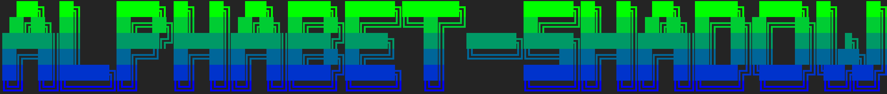

## Quick Start

### Build
```bash
# Using CMake
mkdir build && cd build && cmake .. && make

# Or compile directly
g++ -std=c++17 -o shadow_mode shadow_mode.cpp
```

### Usage
```bash
# Plain text
./shadow_mode "hello"

# With colors
./shadow_mode -c "colored"

# Custom gradient (green to blue)
./shadow_mode -c --start '#00FF00' --end '#0000FF' "gradient"

# Background color mode
./shadow_mode -b --start '#FF6600' --end '#000000' "fire"
```

## Options

| Option | Description |
|--------|-------------|
| `-c`, `--color` | Enable text gradient colors |
| `-b`, `--bg` | Enable background gradient |
| `--start <hex>` | Start color (default: `#E62525`) |
| `--end <hex>` | End color (default: `#000000`) |
| `-h`, `--help` | Show help |


## Supported Characters

- Letters: `a-z`
- Numbers: `0-9`
- Symbols: `!_+-=[]|':"./\|`
